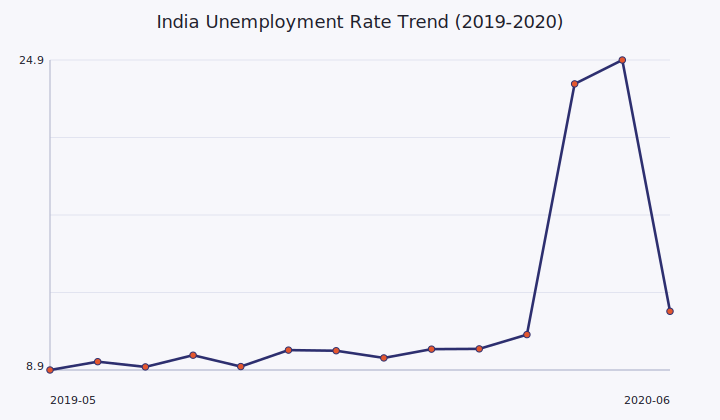
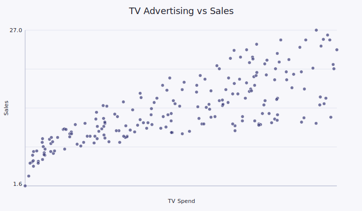
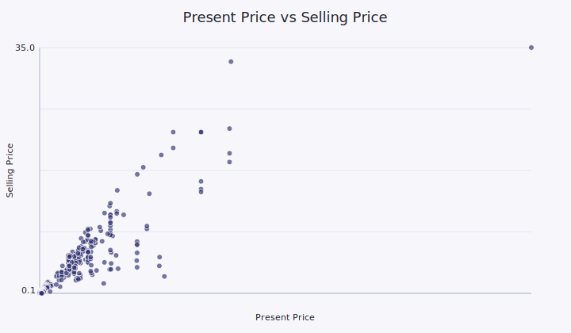

<div align="center">


**A Curated Collection of Machine Learning & Analytics Projects built in Python.**

`Pandas`  |  `Scikit-Learn`  |  `Seaborn`  |  `Matplotlib`  |  `Jupyter`

<br>


</div>

<br><br>

## 🔎 Overview
This repository showcases three end-to-end data science case studies. Each project includes:
- A clean notebook with reproducible analysis
- Dataset files used for modeling
- Visual storytelling and statistical insights
- Model evaluation with clear metrics

<br>

## 🧭 Table of Contents
- [Architecture](#-architecture)
- [Portfolio Projects](#-portfolio-projects)
- [Project Highlights](#-project-highlights)
- [Results Gallery](#-results-gallery)
- [How to Run Locally](#-how-to-run-locally)
- [Metrics & Methodology](#-metrics--methodology)
- [About the Author](#-about-the-author)

## 📂 Architecture

```text
Data_Science_Projects/
├── 1_Unemployment_Analysis/   (Trend Modeling & Geographical EDA)
├── 2_Sales_Prediction/        (ROAS ML Modeling & Regression)
└── 3_Car_Price_Prediction/    (Advanced ML Appraisal Pipeline)
```

<br>

## 📌 Portfolio Projects

<table>
	<tr>
		<td width="33%" valign="top">
			<h3 align="center">01. Unemployment Analysis</h3>
			<p align="center">Trend Modeling • Geo EDA</p>
			<p align="center"><a href="1_Unemployment_Analysis/Unemployment_Analysis.ipynb">Open Notebook</a></p>
		</td>
		<td width="33%" valign="top">
			<h3 align="center">02. Sales Prediction</h3>
			<p align="center">ROAS Modeling • Regression</p>
			<p align="center"><a href="2_Sales_Prediction/Sales_Prediction.ipynb">Open Notebook</a></p>
		</td>
		<td width="33%" valign="top">
			<h3 align="center">03. Car Price Prediction</h3>
			<p align="center">Appraisal Pipeline • ML</p>
			<p align="center"><a href="3_Car_Price_Prediction/Car_Price_Prediction.ipynb">Open Notebook</a></p>
		</td>
	</tr>
</table>

<br>

### 01. Macro-Economic Unemployment Tracking
<div align="center">
	
	<br>
	
</div>

<br>

**Objective**
Analyze the macro-economic shock on unemployment rates in India (2019-2020) and quantify the COVID-19 impact with temporal and regional comparisons.

**Datasets**
- [Unemployment in India.csv](1_Unemployment_Analysis/Unemployment%20in%20India.csv)
- [Unemployment_Rate_upto_11_2020.csv](1_Unemployment_Analysis/Unemployment_Rate_upto_11_2020.csv)

**Workflow**
- Regional EDA with time-series slices and state-level comparisons
- Pre/post COVID segmentation to quantify impact
- Visualization of abrupt regime shifts and recovery trend

**Key Finding**
National unemployment jumped from ~8% to 25%+ in April 2020, signaling a sudden labor market shock.

**Notebook**
- [Unemployment_Analysis.ipynb](1_Unemployment_Analysis/Unemployment_Analysis.ipynb)

<br>

### 02. Advertising ROI & Sales Prediction
<div align="center">
	
	<br>
	
</div>

<br>

**Objective**
Predict product sales from marketing spend and identify the most influential advertising channel.

**Dataset**
- [Advertising.csv](2_Sales_Prediction/Advertising.csv)

**Workflow**
- Correlation analysis and multivariate regression modeling
- Train/test evaluation with baseline and ensemble models
- Error analysis and channel impact ranking

**Best Model**
Random Forest Regressor with ~98% $R^2$ on test data.

**Key Finding**
TV spend shows the strongest positive correlation, while newspaper ads contribute minimal predictive power.

**Notebook**
- [Sales_Prediction.ipynb](2_Sales_Prediction/Sales_Prediction.ipynb)

<br>

### 03. Used-Car Valuation Matrix
<div align="center">
	
	<br>
	
</div>

<br>

**Objective**
Estimate used-car prices using engineered features such as car age, kilometers driven, fuel type, and seller type.

**Dataset**
- [car data.csv](3_Car_Price_Prediction/car%20data.csv)

**Workflow**
- Feature engineering for age and depreciation
- Categorical encoding with label mapping
- Model comparison and validation

**Best Model**
Random Forest with $R^2 > 0.95$ on validation data.

**Key Finding**
Present value explains the majority of resale price variance, with age as a strong secondary factor.

**Notebook**
- [Car_Price_Prediction.ipynb](3_Car_Price_Prediction/Car_Price_Prediction.ipynb)

<br>

## ✨ Project Highlights
- Time-series trend analysis with COVID-era segmentation
- Channel-level contribution ranking for marketing ROI
- Feature engineering with appraisal logic for resale pricing
- Interpretable metrics and visual storytelling across notebooks

<br>

## 🖼️ Results Gallery
<table>
	<tr>
		<td align="center">
			
			<br>
			<sub>Monthly unemployment trend (2019-2020)</sub>
		</td>
		<td align="center">
			
			<br>
			<sub>TV spend vs sales response</sub>
		</td>
		<td align="center">
			
			<br>
			<sub>Present price vs selling price</sub>
		</td>
	</tr>
</table>

<br>

## 🚀 How to Run Locally
1. Clone or download the repository.
2. Ensure Python 3.10+ is installed.
3. Install dependencies:

```bash
pip install pandas numpy matplotlib seaborn scikit-learn jupyter
```

4. Launch Jupyter Notebook:

```bash
jupyter notebook
```

5. Open any project notebook from the folders above and run all cells.

<br>

## 📊 Metrics & Methodology
- **Regression Metrics:** $R^2$, Mean Squared Error (MSE)
- **Feature Handling:** encoding, scaling when needed, and train/test validation
- **Visualization:** trend lines, correlation heatmaps, and regional comparisons
- **Modeling:** linear regression, random forest regression, and baseline comparisons

<br><br>

---

<br><br>

<div align="center">

### 👤 About the Author
Designed by **Piyush Ramteke**


</div>